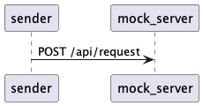

Sreda Talents exercise.
====

Тестовое задание.

Необходимо написать программу(сервис) реализующим функционал отправки запросов на сторонний сервис(реализация webhook).

Пример конфигурации

```yaml
url: https://some.domain
requests:
  amount: 1000
  per_second: 10
```

Отправляем POST запросом на url запросы с 
body = 
```json
{ "iteration": ${number} }
```

где number порядковый номер итерации из requests.amount. 

Реализация должна учитывать количество отправляемых запросов `request.per_second`. 

Написать тест для предложенной реализации.

# Реализация

Реализуем 2 приложения:

- клиент (sender)
- сервер (mock_server)

@startuml
sender -> mock_server: POST /api/request
@enduml



## Запуск клиента (sender)

```shell
export SENDER_CONFIG_PATH=config/prod.yaml && go run ./cmd/sender
```

путь к конфигу задаётся через переменную окружения `SENDER_CONFIG_PATH`, 

по умолчанию `config/local.yaml`


## Запуск сервера (mock_server)

```shell
go run ./cmd/mock_server
```
Порт запуска сервера задаётся через переменную окружения `MOCK_SERVER_PORT`, по умолчанию 8091.

Режим запуска сервера (local/prod) задаётся через переменную окружения `MOCK_SERVER_ENV`, по умолчанию `local`.


## Запуск сервера (mock_server) в docker

```shell
docker-compose up -d
```

## Останов сервера (mock_server) в docker

```shell
docker-compose down
```


## Проверка работы mock_server'а

```shell
POST http://localhost:8091/api/request
```
## Примеры запросов

### Успешный запрос

тело запроса:
```json
{
  "iteration": 42
}
```

ответ:

Status 200 OK

пустое тело ответа

### Ошибочный запрос (пустое тело запроса)

ответ:

Status 400 Bad Request

`Failed to decode request body: EOF`

### Ошибочный запрос (ошибка в теле запроса)

тело запроса:
```json
{
  "iteration666": 666
}
```

ответ:

Status 418 I'm a teapot

`Failed to decode request body: iteration is zero`

## Тестирование функции ограничения количества запросов в секунду

```shell
go test sreda/internal/processes -v
```

### Результаты тестирования

```shell
=== RUN   TestSender_Run
[12:56:56.875] DEBUG: Run iterations {
  "amount": 10,
  "per_second": 1
}
[12:57:57.878] DEBUG: Request sent {
  "iteration": 1,
  "status_code": 200,
  "time": "2023-11-18 12:37:57.87893 +0400 +04 m=+1.005706792"
}
[12:58:58.877] DEBUG: Request sent {
  "iteration": 2,
  "status_code": 200,
  "time": "2023-11-18 12:37:58.877637 +0400 +04 m=+2.004408501"
}
[12:59:59.877] DEBUG: Request sent {
  "iteration": 3,
  "status_code": 200,
  "time": "2023-11-18 12:37:59.877517 +0400 +04 m=+3.004284292"
}

. . .
```

Частота запросов 1 в секунду ("per_second": 1).
По тексту лога видно, что выполняется 1 запрос в секунду.

Если увеличить параметр `per_second`, то количество запросов соответственно увеличится.

Тест `TestSender_RunCount` проверяет количество запросов автоматически (что число запросов в секунду не превышает заданное значение `PerSecond`).